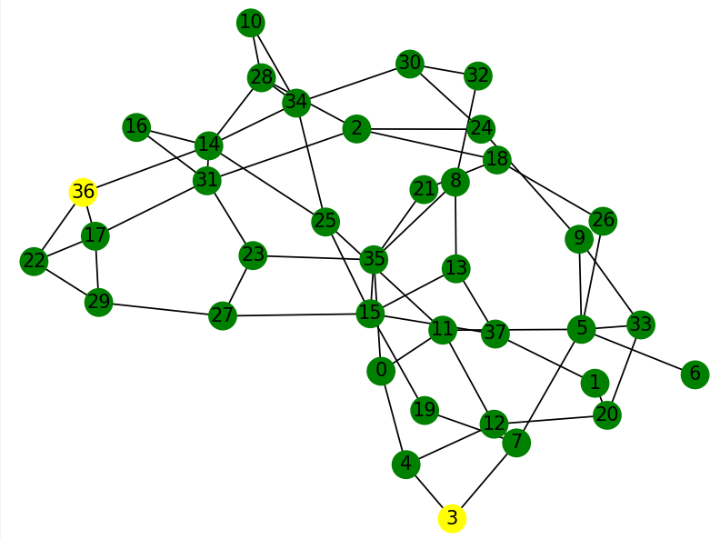

# ant-routing-simul
## Python simulation of the Ant Routing algorithm 

### Running the app
```bash
$ python main.py
```
### Example output
```text
Distance is 6
alice: 3 [4, 7]
bob: 36 [14, 17, 22]
Alice got 9 matches
Choosing a match
Handling check
 3, 4, 0, 35, 23, 31, 14, 36,
Payment info:
Match selected:
 MatchData(match_id=70, from_id=4, sum_counter=240, fees=420, timestamp=108)
 fees: 142
 matching time: 1.6s
```

